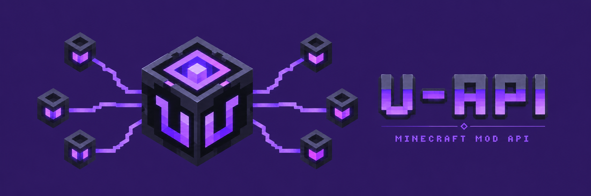

# U-API

<p align="center">
  <a href="https://github.com/tracerxbrhd/u-api/releases"></a>
  <a href="https://github.com/tracerxbrhd/u-api/actions/workflows/ci.yml"></a>
  <a href="https://modrinth.com/mod/u-api"></a>
  <a href="https://www.curseforge.com/minecraft/mc-mods/u-api"></a>
</p>

**U-API is the shared technical foundation for the Underworld Studio Minecraft mod ecosystem.** It provides reusable services, retained UI, HUD and world overlays, networking primitives, diagnostics, instance lifecycle, social and permission contracts, and optional integration points for dependent mods.

U-API is primarily a library. Install it when another mod lists U-API as a dependency; by itself it is not intended to add a standalone gameplay loop.

## Compatibility

| Minecraft | U-API line | Java | Loader |
| --- | --- | --- | --- |
| 1.21.1 | 2.x | 21 | NeoForge |
| 26.2 | 3.x | 25 | NeoForge |

The default `master` branch currently contains the Minecraft 1.21.1 / U-API 2.x source line. Stable releases for other supported Minecraft versions are available from the download links above.

## What U-API provides

- shared service and lifecycle infrastructure;
- retained UI, HUD and world-overlay primitives;
- bounded networking and diagnostics;
- social, profile and permission contracts;
- managed instance lifecycle used by dependent gameplay mods;
- optional integration helpers, including inventory-side UI extensions;
- compatibility infrastructure for modded environments.

## Configuration

For the 1.21.1 line, configuration is stored under `config/uapi/u-api/` as `common.toml`, `client.toml` and `server.toml`. Optional JSON-driven inventory helper buttons use `config/uapi/u-api/sidebar_buttons.json`.

U-API does not provide a general-purpose in-game configuration editor.

## Documentation

- [API 2 foundation](docs/API_2_FOUNDATION.md)
- [Profile facets](docs/PROFILE_FACETS.md)
- [Sidebar buttons](docs/SIDEBAR_BUTTONS.md)
- [Worldgen integration](docs/WORLDGEN_INTEGRATION.md)
- [Release process](docs/RELEASING.md)

## Building from source

The default branch requires Java 21.

```bash
./gradlew build
```

On Windows:

```powershell
gradlew.bat build
```

## License

U-API source code is licensed under the [GNU Lesser General Public License v3.0](LICENSE) (`LGPL-3.0-only`).
